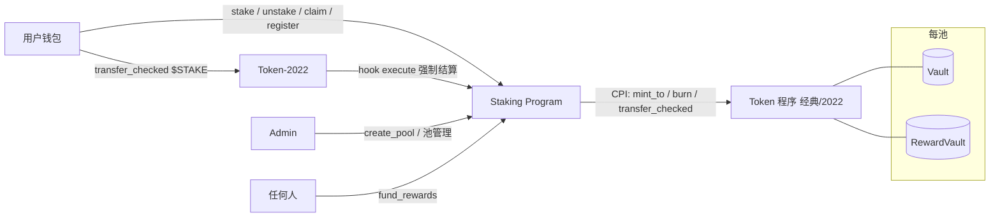

# Solana 质押程序 技术设计文档

## 1. 概述与设计目标

### 1.1 一句话描述

一套部署承载多个质押池;每个池中,用户存入输入代币(如 $BEEF),获得等额、可自由转让的质押凭证 $STAKE(Token-2022 TransferHook,每笔转账强制结算奖励);按 MasterChef 模型持续累积奖励(如 $MILK,预存金库发放);本金随时赎回,奖励独立领取。

### 1.2 设计目标

1. 正确性:本金精确赎回;奖励按份额 × 时长公平分配;token account 余额即唯一账本,转账经 hook 结算后余额恒可信。
2. O(1):任何指令的开销与用户总数、池数量无关(§6.1)。
3. 多池复用:admin 按需建池,池间账务、资金、权限完全隔离(§4.2)。
4. 动态排放:速率与截止时间运行时可调,改参数不影响已结算奖励;曲线形状为预留扩展(§6.5)。
5. 本息解耦:unstake 与 claim 独立;转让不带息(已产生利息留在转出方)。
6. 代币通用性:输入与奖励代币兼容经典 SPL 与 Token-2022,fee 代币以余额差正确入账。

### 1.3 非目标

主网部署、多 Config 实例、池级独立 admin(单一全局 admin 管理所有池)、带息转让、复利再质押、链上治理、$BEEF / 奖励代币使用外来 transfer-hook 代币(§9)。

---

## 2. 术语表

仅列本项目特有概念;PDA / CPI / Mint / ATA 等通用概念不赘述。

| 术语                 | 含义                                                         |
| -------------------- | ------------------------------------------------------------ |
| Config / Pool        | 两级状态:Config 全局单例(admin、pool_count、全局急停);Pool 每池一个,承载全部池级账务与参数 |
| acc_reward_per_share | 累计每股奖励,每池一个的 MasterChef 全局累加量(放大 ACC_PRECISION 倍) |
| reward_debt          | 用户上次结算时的基准,pending = 余额 × acc − debt 的减项      |
| pending_unclaimed    | 已结算未领取的奖励;stake / unstake / 转账结算时累入,claim 清空发放 |
| TransferHook         | Token-2022 mint 扩展:每笔转账由代币程序回调指定程序;本设计中 hook 指向本程序,用于强制结算 |
| 注册                 | 为一个 $STAKE token account 创建对应 UserInfo;未注册的账户不能接收 $STAKE |
| Vault / RewardVault  | 每池两个金库(本金 / 奖励),authority 均为该池的 Pool PDA      |

---

## 3. 架构与关键流程

### 3.1 组件总览



一套部署:一个 Config 单例,其下 N 个 Pool;每个 Pool 拥有独立的 $STAKE mint、双金库和用户账本。update_pool()(按池结算)与 emission_between()(排放)为内部函数,所有改变份额的路径(含 hook)第一步先结算。

### 3.2 Stake 时序

### 3.3 Unstake 时序(双守卫:余额预检 + burn)

### 3.4 Claim 时序

### 3.5 Transfer 时序(hook 强制双边结算)


---

## 4. 代币与账户设计

### 4.1 三种代币(每池一组)

| 代币   | 角色                    | Token 程序                               | 铸币权              | 程序如何触碰                                     |
| ------ | ----------------------- | ---------------------------------------- | ------------------- | ------------------------------------------------ |
| $BEEF  | 输入 / 本金             | 任意(经典或 2022)                        | 外部                | transfer_checked 进出 Vault,入账以金库余额差为准 |
| $STAKE | 质押凭证,余额即本金账本 | Token-2022 + TransferHook(hook = 本程序) | Pool PDA            | 质押 mint、赎回 burn、转账触发 hook 结算         |
| $MILK  | 奖励                    | 任意(经典或 2022)                        | 外部持有,程序不持有 | 仅从 RewardVault transfer_checked 转出           |

要点:

- 程序唯一持有的铸币权是各池的 $STAKE。奖励代币对程序而言只是金库里的一种代币,任何现存 SPL 资产都可直接充当。
- Pool PDA 地址由 config + staked_mint + reward_mint 推导,不含 stake_mint——因此可以先算出 Pool 地址、再创建 $STAKE mint 并把铸币权和 hook 指向它,create_pool 时链上校验。
- "拒绝 transfer-hook 代币"(§9)指 $BEEF 与奖励代币不得使用外来 hook 资产;$STAKE 自身的 hook 是本程序,不在此列。

### 4.2 PDA 体系(两级)

todo

* pda solana生成

地址由 find_program_address(seeds, program_id) 唯一确定,链下与链上各自独立推导、结果一致。

| 账户                      | seeds                                          | 数量                  | 说明                                                         |
| ------------------------- | ---------------------------------------------- | --------------------- | ------------------------------------------------------------ |
| Config                    | [b"config"]                                    | 全局唯一              | initialize_config 创建                                       |
| Pool                      | [b"pool", config, staked_mint, reward_mint]    | 池                    | 同币对重复建池在推导上不可能;兼任该池金库 authority 与 $STAKE 铸币权 |
| VaultATA / RewardVaultATA | [b"vault", pool] / [b"reward_vault", pool]     | 每池各一              | token account                                                |
| UserInfo                  | [b"user", stake_token_account]                 | 每 token account 一个 | 按 token account 键控(而非按钱包):余额即账本,奖励状态必须跟着持币账户走 |
| ExtraAccountMetas         | [b"extra-account-metas", stake_mint](spl 规范) | 每池一个              | create_pool 时初始化,声明 hook execute 需要的额外账户(pool、双方 UserInfo)及其推导规则 |

跨池隔离(安全核心):每条用户指令的全部子账户都被约束派生自同一 pool——UserInfo 经 token_account.mint = pool.stake_mint 锁定,金库经 seeds 含 pool 锁定,mint 经 address = pool.x_mint 锁定。跨池账户替换是测试矩阵的头号攻击项(§11)。

### 4.3 数据结构

```rust
#[account]
pub struct Config {              // 单例
    pub admin: Pubkey,
    pub pool_count: u64,         // no need
    pub paused: bool,            // 全局急停:冻结所有池的 stake / claim(unstake 不受影响)
    pub bump: u8,
    pub reserved: [u8; 64],
}
```

```rust
#[account]
pub struct Pool {
    pub config: Pubkey,
    pub staked_mint: Pubkey,     // $BEEF
    pub stake_mint: Pubkey,      // $STAKE(Token-2022 + TransferHook)
    pub reward_mint: Pubkey,
    pub vault: Pubkey,
    pub reward_vault: Pubkey,
    pub total_staked: u64,       // 仅 stake/unstake 改变;转账不影响总量
    pub acc_reward_per_share: u128,  // 放大 ACC_PRECISION(1e12,编译期常量)
    pub last_reward_time: i64,
    pub start_time: i64,         // 排放开始,此前不排放(§9)
    pub end_time: i64,           // 排放截止,0 = 无上限;总负债自此封顶
    pub reward_per_sec: u64,     // 运行时可调
    pub total_emitted: u128,     // update_pool 累加;空池期不增长
    pub total_claimed: u64,      // claim 累加
    pub status: u8,              // 0 Active / 1 Paused
    pub bump: u8,
    pub vault_bump: u8,
    pub reward_vault_bump: u8,
    pub reserved: [u8; 64],
}
// 未偿负债 = total_emitted − total_claimed:水位监控、盈余取回、池子关闭共用同一把尺子。
```

```rust
#[account]
pub struct UserInfo {
    pub pool: Pubkey,
    pub token_account: Pubkey,   // 绑定的 $STAKE token account;其余额即本金
    pub reward_debt: u128,
    pub pending_unclaimed: u64,
    pub bump: u8,
    pub reserved: [u8; 16],
}
// 没有 amount 字段:本金账本就是代币余额本身。
// stake 时 init_if_needed 自动注册;接收转账前须先注册(register),否则 hook 拒绝转账。
```

---

## 5. 指令接口

### 5.1 调用者模型

| 调用者          | 身份判定                                          | 说明                                             |
| --------------- | ------------------------------------------------- | ------------------------------------------------ |
| 用户            | 交易签名者 + token account 归属(token::authority) | 任意钱包;只能操作自己 token account 对应的仓位   |
| Admin           | has_one = admin(Config 记录)                      | 全局唯一,管理所有池;能力边界见 §8                |
| Token-2022 程序 | transferring 标志校验                             | hook execute 的唯一合法调用方;直呼被拒           |
| 任何人 / bot    | 无约束                                            | fund_rewards、register(代人注册)、faucet(devnet) |

程序没有必须定期调用才能保持正确的指令:懒结算在任意交互(含转账)时刻按公式补齐。唯一的 bot 是链下水位监控:按池核对 RewardVault 余额 ≥ total_emitted − total_claimed,低水位告警或代付 fund_rewards,零链上特权。

### 5.2 指令总表

todo

*  close pool
* set_pause 解耦 四个方法

| 指令                                              | 调用者                 | 权限约束                                                   | 效果                                                         |
| ------------------------------------------------- | ---------------------- | ---------------------------------------------------------- | ------------------------------------------------------------ |
| initialize_config()                               | 部署者                 | 一次性                                                     | 创建 Config 单例,记录 admin                                  |
| create_pool(reward_per_sec, start_time, end_time) | Admin                  | 可重复;end_time = 0 或(> now 且 > start_time)              | 创建 Pool / Vault / RewardVault / ExtraAccountMetas;校验 stake_mint:铸币权 = Pool PDA、TransferHook 指向本程序;beef / reward mint 拒绝外来 hook 扩展;pool_count += 1 |
| stake(amount)                                     | 用户                   | 要求全局与本池均未暂停                                     | UserInfo init_if_needed(自动注册)→ 结算(按当前余额,pending 落袋)→ $BEEF 入 Vault(余额差入账)→ total_staked 加记 → 铸 $STAKE = 实际到账(Pool PDA 签名)→ debt 按新余额重置 |
| unstake(amount)                                   | 用户                   | 任何状态下可用                                             | 结算 → 余额预检(≥ amount)→ burn(守卫)→ Vault 退还 $BEEF(Pool PDA 签名)→ total_staked 减记、debt 按烧后余额重置 |
| claim_rewards()                                   | 用户                   | 要求未暂停                                                 | 结算 → RewardVault 转出全部 pending_unclaimed(不足整笔失败,§9)→ total_claimed 累加 → 清零 pending、debt 重置 |
| register(token_account)                           | 任何人                 | token account 的 mint = pool.stake_mint                    | 为指定 $STAKE token account 创建 UserInfo(payer = 调用者);接收转账的前置条件 |
| close_user_info()                                 | token account 所有者   | 余额 = 0 且 pending = 0                                    | 关闭 UserInfo,租金退还                                       |
| transfer_hook execute                             | Token-2022(经转账 CPI) | transferring 标志 + 双方已注册                             | 双边结算:双方按转账前余额结算 pending 落袋、按转账后余额重置 debt;纯记账,不外发 CPI(§5.3) |
| fund_rewards(pool, amount)                        | 任何人                 | 只进不出                                                   | 向该池 RewardVault 充值,发 FundEvent                         |
| set_emission(pool, reward_per_sec, end_time)      | Admin                  | end_time 校验同 create_pool                                | 先 update_pool 按旧速率结算至今,再写新值                     |
| set_pause(pool?, paused)                          | Admin                  | —                                                          | 池级 status 或全局 paused;冻结 stake / claim,unstake 与转账不冻结 |
| withdraw_surplus(pool, amount)                    | Admin                  | amount ≤ RewardVault 余额 −(total_emitted − total_claimed) | 取回超额注资;不变量保证用户已赚部分不可取(§8)                |
| transfer_admin(new_admin)                         | Admin                  | —                                                          | 直接转移全局 admin(两步交接列为扩展)                         |
|                                                   |                        |                                                            |                                                              |

通用约定:金额参数 > 0;所有改变份额的路径(stake / unstake / hook)第一步先 update_pool();暂停门控不对称——只挡新钱进入(stake)与金库流出(claim),退出本金(unstake)与凭证转让(纯记账)任何状态可用。

### 5.3 Hook 结算机制(可转让的正确性来源)

MasterChef 铁律是"份额变动前必先结算";经典 SPL 下转账绕过程序,余额因此不配做账本。TransferHook 把转账本身纳入结算:Token-2022 在每笔 $STAKE 转账内 CPI 调用本程序的 execute,后者:

1. 校验 transferring 标志——execute 只能出现在真实转账的调用栈里,直呼被拒;
2. 校验双方 UserInfo 已注册,接收方未注册则整笔转账回滚;
3. update_pool 后做双边结算:hook 看到的是转账后余额,转出方按(余额 + amount)、接收方按(余额 − amount)结算各自 pending 落袋,双方 debt 按转账后余额重置;
4. 纯记账,不外发任何 CPI——hook 内账户全部降权,这也是设计上最小化 hook 职责的原因。

结算语义即"转让不带息":转出方已产生的利息在转让瞬间落入其 pending_unclaimed,接收方从转让时刻起以新余额计息。洗转账(来回倒手)不产生任何额外奖励,只是反复结算。

mint 与 burn 不触发 hook,故 stake / unstake 保持指令内结算,与转账结算互不重叠。

---

## 6. 奖励算法

### 6.1 为什么必须 O(1)

web2 发利息是 push(cron 遍历用户加钱);链上被三重约束同时否决:单笔交易计算限量(默认 20 万 CU)、账户必须显式传入(交易 1232 字节装不下一万个用户账户——不是贵,是做不到)、合约被动无 cron。因此模型反转为 pull(懒结算):谁交互谁结算,其他人的账先记着。

> 链上设计铁律:任何指令的开销必须与用户总数无关。O(1) 不是性能优化,是协议能否无限接纳用户的生存条件。

MasterChef 的解法:每池维护一个全局累加量 acc_reward_per_share,每个持仓用 reward_debt 记住结算基准,任意时刻:

```
pending = 余额 × acc_reward_per_share / ACC_PRECISION − reward_debt
```

### 6.2 池子结算 update_pool

记当前时刻 t,上次结算 t₀ = last_reward_time,S = total_staked,P = ACC_PRECISION:

```
若 t ≤ t₀:不做事
若 S = 0:仅推进 last_reward_time(不排放,total_emitted 不增长)
否则:
  reward               = emission_between(t₀, t)
  acc_reward_per_share += reward × P / S
  total_emitted        += reward
  last_reward_time      = t
```

### 6.3 数值示例(实现后第一组测试按此断言)

设恒定速率 10 $MILK/秒,ACC_PRECISION = 1e12:

| 时间 | 事件         | total_staked | acc(÷1e12) | 说明                                    |
| ---- | ------------ | ------------ | ---------- | --------------------------------------- |
| t=0  | Alice 存 100 | 100          | 0          | Alice.debt = 0                          |
| t=10 | Bob 存 100   | 200          | 1.0        | 100 奖励 ÷ 100 份 = +1.0;Bob.debt = 100 |
| t=20 | Alice claim  | 200          | 1.5        | 100 奖励 ÷ 200 份 = +0.5                |

Alice pending = 100 × 1.5 − 0 = 150(0–10 独占 100,10–20 半池 50);Bob = 100 × 1.5 − 100 = 50。转账不改变本表任何数字——若 t=15 Alice 把 100 $STAKE 转给 Carol,Alice 的 125 落袋、Carol 从 t=15 起以 100 余额计息,总量守恒。

### 6.4 排放函数 emission_between(a, b)

恒定速率,区间两端做起止截断:

```
a' = max(a, start_time)
b' = end_time > 0 ? min(b, end_time) : b
返回 b' > a' ? reward_per_sec × (b' − a') : 0      // u128 运算
```

速率的"动态"由运行时调参实现(set_emission,先结算再改值),与 MasterChef v2 的 owner 可调 sushiPerBlock 同构——Solana 无稳定块间隔,per-block 的正确对应是 per-second。

end_time 的经济含义:总负债自截止时刻封顶,开池注资额 = reward_per_sec × (end_time − start_time),一次注满后偿付充足是可证明的静态事实。运行时上调速率或延长 end_time 等于扩大负债,需相应补注资。

### 6.5 排放配置化与扩展

| 配置项                       | create_pool | 运行时          | 修改者        | 约束 / 说明                              |
| ---------------------------- | ----------- | --------------- | ------------- | ---------------------------------------- |
| staked / stake / reward mint | ✓           | ✗               | Admin(建池时) | 币对即池子身份,且直接参与 Pool seeds     |
| reward_per_sec               | ✓           | ✓(set_emission) | Admin         | 改前先结算,已结算奖励不受影响            |
| start_time                   | ✓           | ✗               | Admin(建池时) | 排放开始时刻(§9)                         |
| end_time                     | ✓           | ✓               | Admin         | 0 = 无上限;非零须 > now 且 > start_time  |
| status / paused              | 固定 Active | ✓               | Admin         | 池级与全局两档(§5.2)                     |
| ACC_PRECISION                | 编译期常量  | ✗               | —             | 运行时改精度会使存量 acc / debt 语义错乱 |

曲线形状扩展(挑战问"如何实现衰减式动态速率",此处为设计答案):排放隔离为独立纯函数,引入形状只需 Pool 加 emission_mode 枚举、在 emission_between 内分派(枚举只追加不重排)。以线性衰减为例:r(t) = max(r₀ − k·(t − anchor), r_min),区间积分有闭式解(按触底点切梯形段 + 矩形段),配合调参时锚点重置即可保证新旧参数段互不污染。该方案在早期版本中已完整实现并通过测试;当前取可调恒定速率为默认形状,是复杂度取舍而非能力限制。

---

## 7. 角色与权限

| 角色               | 范围                  | 权限                                                         |
| ------------------ | --------------------- | ------------------------------------------------------------ |
| 程序升级权         | 部署层                | 可替换整个程序,凌驾一切链上角色。devnet = 部署者钥匙;生产方案 = 转多签或销毁使程序不可变——本表其余承诺以此层处置为前提 |
| Admin              | 全局(单一,管理所有池) | 建池、调排放、暂停(仅冻 stake / claim,永不可冻 unstake 与转账)、取盈余(受偿付不变量约束)、转移 admin。触不到用户本金与已赚奖励(§8) |
| 用户               | 每 token account      | stake / unstake / claim / close,凭 token account 归属签名;转让即普通 transfer |
| 任何人             | —                     | fund_rewards(只进不出)、register(代人注册只花自己租金)、faucet(devnet) |
| 水位监控 bot(链下) | 运维                  | 按池核对余额 ≥ total_emitted − total_claimed;零链上特权      |
| Pool PDA           | 每池                  | $STAKE 铸币权、双金库 authority;无私钥,仅本程序 seeds 代签   |

---

## 8. 安全设计(仅列本项目特有项)

1. 余额即账本的成立条件:经典 SPL 下余额场外可变、不配做账本;本设计以 TransferHook 把每笔转账纳入强制结算(§5.3),份额的每一种变动路径(mint / burn / transfer)都先经 update_pool,余额因此恒可信。hook 纯记账、不外发 CPI,职责最小化。
2. unstake 双守卫:余额预检给出干净错误,burn 是实际守卫;两者同一原子交易,超赎在代币程序层面不可能。
3. 跨池隔离:全部子账户约束派生自同一 pool(§4.2);跨池账户替换攻击为测试矩阵头号项。
4. 铸币权最小化:程序仅持各池 $STAKE 铸币权;奖励代币铸币权不在程序手中,程序被攻破也无法增发奖励,损失以金库余额为界。
5. mint 与 token 程序双重绑定:address = pool.x_mint + token_program 约束,防伪造代币与经典 / 2022 程序混用。
6. Admin 权限边界:调参先结算,已结入 acc / pending 的奖励不可剥夺;暂停不对称,unstake 与转让永远放行;取盈余受不变量 amount ≤ 余额 −(total_emitted − total_claimed)约束。管理面最坏情况是"未来不再发奖励"。
7. 盈余不变量的保守性:负债按 total_emitted 计,因整除灰尘略高于实际可领总额,盈余被略微低估——方向安全,灰尘量级 $MILK 永锁金库,可忽略。
8. hook 触达控制:execute 校验 transferring 标志,只能出现在真实转账调用栈内;直呼被拒。接收方未注册即整笔回滚,不存在"收到币但没有账本"的状态。
9. 开放指令无 grief 向量:fund_rewards 只进不出;register 代人注册只消耗调用者租金;faucet 仅 devnet 且只增发测试本金,主网编译期移除。
10. 通用项:全程 checked_*;PDA 一律 seeds + bump;checks-effects-interactions;交易原子性保证 CPI 失败整笔回滚。

---

## 9. 设计决策清单

已决(评审可推翻):

1. 金库不足时 claim:整笔失败,pending 保留,依水位监控充值。备选:部分发放(账目复杂);Synthetix 式充值定速率(end_time + 足额注资已达成等效保证)。
2. $STAKE 扩展:TransferHook 指向本程序,create_pool 链上强校验(早期 NT 方案见 §10.4)。
3. Transfer Fee 代币($BEEF / 奖励):统一余额差入账;仅入金用余额差,出金按数额转,fee 由收款方承担。
4. 暂停范围:冻结 stake 与 claim;unstake 与凭证转让任何状态可用。
5. 盈余取回:withdraw_surplus 受偿付不变量约束(§8.6)。
6. 转让不带息:已产生利息在转让瞬间落入转出方 pending_unclaimed。
7. 接收前置注册:未注册账户收 $STAKE 被整笔拒绝;stake 自动注册,register 开放代付。

待确认:

8. 外来 transfer-hook 代币(作为 $BEEF / 奖励):声明不支持,需 LD 确认。
9. ACC_PRECISION:1e12 编译期常量,是否需复核大额场景。
10. start_time 来源:固定建池时刻,还是允许设定未来起点。
11. transfer_admin 是否升级为两步交接(pending + accept)。

---

## 10. 备选方案考虑

### 10.1 奖励 mint-on-demand(v2 方案,已放弃)

程序持奖励铸币权、claim 现铸,不存在金库不足。放弃原因:奖励只能是程序自有代币,无法用 USDT 等现存资产。预存金库换来任意代币能力,代价是偿付边界(§9.1),由 end_time + 足额注资收敛。

### 10.2 本金账本的四条路

- 经典 SPL 余额做账本:不可行。余额场外可变,违反"份额变动必先结算";接收方 reward_debt 无合法初值(填 0 窃取历史奖励,填当前基准则奖励归属随倒手重分配)。
- 彻底删凭证(Synthetix 原始形态):账务正确,但挑战硬性要求铸 / 烧 receipt token,不合规。
- UserInfo.amount 权威 + NT 收据(v3.0–3.2 采用):正确且简单,代价是凭证不可流通。
- 余额即账本 + TransferHook 强制结算(v3.3 采用):hook 把"必先结算"延伸到转账,余额恒可信;账本与代币合一,凭证获得真实流通性。代价见 10.4。

### 10.3 xSUSHI 式份额增值模型

brief 的 "or ratio-based" 允许浮动汇率凭证,但奖励部分点名 MasterChef 且要求本息分离;份额增值把奖励折进凭证价格,与指定模型冲突,出局。

### 10.4 NT + 程序内 transfer_position(被 10.2 第四条取代)

保留 NT、以专用指令做程序内转让,复杂度低于 hook。取 hook 的原因:标准 transfer 语义——钱包直接转账即可流通,无需集成专用指令。接受的代价:接收前置注册、hook 代币在部分钱包 / 协议中的兼容性弱、hook 实现与审计面更大。若 Phase 2 受阻,本条即回退路径。

### 10.5 结算策略 A(立即发放)vs B(累计后领,已采用)

策略 B 把唯一动用奖励金库的动作收敛到 claim,本金操作与转让在任何金库状态下必定成功;hook 结算纯记账的前提也依赖 B(hook 内不允许外发 CPI,策略 A 在 hook 里根本无法实现)。

### 10.6 线性衰减排放(早期方案,已简化)

brief 对排放的实际要求是"支持动态变化",衰减仅为举例。可调恒定速率以约三分之一代码量满足要求,且与 MasterChef v2 原始机制一致;衰减保留为 emission_mode 扩展首个形状(§6.5),按需一次升级启用。

---

## 11. 测试策略

既有用例全部适配(账本断言从 user.amount 改为 token account 余额),新增两组:

| 组       | 用例                                    | 断言要点                                                     |
| -------- | --------------------------------------- | ------------------------------------------------------------ |
| 基础     | initialize_config / create_pool         | Config 单例;Pool 字段、双金库、$STAKE 铸币权 = Pool PDA、TransferHook 指向本程序;同币对重复建池被拒 |
| 基础     | stake / unstake / claim / 多用户时序    | §6.3 数值表(Alice 150 / Bob 50);余额差入账;pending 累计;total_claimed 同步 |
| 基础     | 调参 / 截断 / 资金充足                  | 调参前后两段各按各自速率;跨 end_time 只积到截止;注资 = rate × (end − start) 后全员可清场 |
| 基础     | 暂停 / 盈余 / 关闭                      | Paused 下 stake / claim 拒、unstake 与转账通;盈余上限 = 余额 − 未偿负债,超取拒;双零可关、租金退还 |
| T-P 多池 | T-P1 建两池                             | 独立参数、独立金库                                           |
|          | T-P2 双池并行记账                       | 两池各自跑 §6.3 时序,手算独立验证                            |
|          | T-P3 同币对重复建池                     | 被 seeds 推导拒绝                                            |
|          | T-P4 跨池账户替换矩阵                   | 用 A 池 UserInfo / 金库 / mint 调 B 池指令,逐组合被拒        |
|          | T-P5 全局急停 vs 池级暂停               | 两档独立生效,unstake 均放行                                  |
|          | T-P6 分池水位                           | 各池负债独立核对                                             |
|          | T-P7 admin 转移                         | 旧 admin 失权、新 admin 生效                                 |
| T-H 转让 | T-H1 单次转让                           | 双边结算对手算值(hook 按转账后余额,断言显式覆盖 pre/post 语义) |
|          | T-H2 转让后 claim                       | 双方各领各的,总量守恒                                        |
|          | T-H3 洗转账回归                         | 高频来回倒手,总奖励不多发一枚                                |
|          | T-H4 未注册接收                         | 整笔转账回滚                                                 |
|          | T-H5 直呼 hook                          | transferring 标志校验拒绝                                    |
|          | T-H6 mint / burn 不触 hook              | stake / unstake 结算路径与 hook 路径互不重叠                 |
|          | T-H7 转让后 unstake                     | 接收方可赎、转出方按剩余余额赎                               |
| 边界     | amount = 0 / 超赎 / 无奖励 claim / 溢出 | AmountZero / 余额预检拒 / NothingToClaim / MathOverflow      |